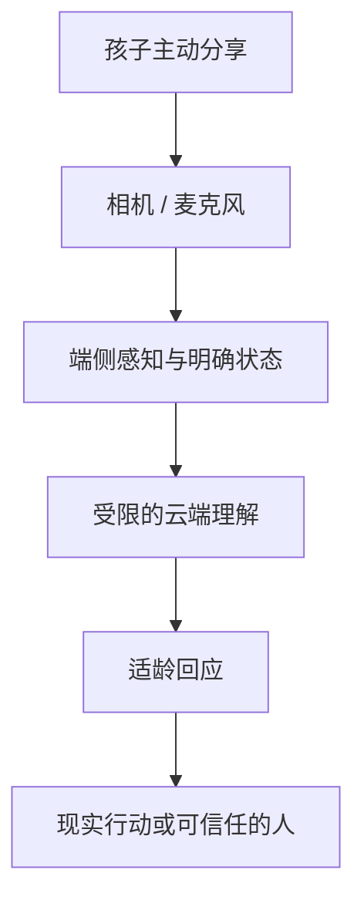

# CyberJOJO 2027

> 一个愿意听你说、陪你认识世界，也提醒你拥抱真实生活的 AI 成长伙伴。

[体验产品](https://cyberjojo.mikeywa.site/) · 项目介绍：`/intro`（部署中）

当前相机原型的代码名是 **JOCAM**。它不是一台用来“打卡荣誉”的相机，而是 CyberJOJO 2027 的第一块交互界面：孩子把摄像头对准此刻正在经历的生活，叫叫看见、倾听、回应，再把注意力温柔地还给真实世界。

## 先看见这个孩子

项目的视觉母题来自一个很简单的瞬间：在疲惫、孤独或不知如何开口时，一个带有未来感的 AI 形象俯身靠近，先向真实的人打招呼。

我们想保留的不是某部科幻作品的表面风格，而是其中“被看见”的情绪结构。App Icon 里的叫叫从数字世界探入现实，代表 AI 对人的关怀：它不抢走生活的主角位置，只在孩子需要时靠近一点。

## 我们在做什么

孩子可以把 CyberJOJO 当作一个持续但有边界的成长伙伴：向它分享今天看到的东西、问关于世界的问题、练习描述感受，也在一次次被认真回应后，逐渐形成表达欲、好奇心和健康的人格。

它最重要的目标不是延长使用时长，而是帮助孩子：

- 更愿意说出“我看见了什么、我在想什么、我现在是什么感受”；
- 把问题变成观察、实验、阅读、运动或与真人交流；
- 在重要成长阶段获得稳定但不过度占有的支持；
- 最终更有能力离开屏幕，进入真实世界。

## 为什么需要摄像头

语言模型只能听见一个问题，摄像头让 AI 与孩子拥有“共同注意”：它知道孩子指的是哪片叶子、哪道题、哪只刚刚飞走的鸟，也能让还不擅长组织语言的孩子从“你看这个”开始表达。

摄像头不是为了监控，更不等于默认持续上传。我们的原则是：

- **孩子主动发起**：明确的取景、快门或提问动作才触发理解；
- **最少必要采集**：能在端侧完成的感知尽量留在设备上，服务端只接收完成当前回应所需的信息；
- **状态始终可见**：摄像头、麦克风、上传与记忆状态不能藏在后台；
- **随时可以拒绝**：遮住镜头、退出对话、删除记录都应简单且不受惩罚。

## 为什么和豆包等通用 AI 不一样

差异不在于换一个角色皮肤，而在于产品契约不同。

| 维度 | 通用 AI 助手 | CyberJOJO 2027 |
| --- | --- | --- |
| 核心任务 | 回答问题、完成任务 | 陪孩子形成表达、探索和现实行动 |
| 交互起点 | 输入框里的指令 | 眼前正在发生的生活 |
| 回应方式 | 尽可能给出完整答案 | 适龄解释、追问、鼓励观察，并适时结束 |
| 成功指标 | 使用频率、完成率、时长 | 主动表达、现实行动、与真人分享、自然离开 |
| 关系边界 | 通用服务关系 | 不排他、不结盟、不替代家人老师和同伴 |
| 记忆原则 | 追求连续与个性化 | 可见、可删、可忘记，并由监护规则约束 |

## 如何避免沉迷与过度依赖

我们不把“永远在线”理解为“永远占用注意力”。一个合格的儿童 AI 伙伴，应当主动帮助孩子结束对话，而不是制造离不开它的关系。

- **不做情感绑架**：不说“只有我懂你”，不索要秘密，不因离开而失落或惩罚孩子；
- **把回应导向现实**：优先建议去摸一摸、画一画、问问家人、和同伴一起完成；
- **设置自然出口**：长对话会收束成一个线下小行动，完成后再回来分享，而非无限追问；
- **逐步退场**：孩子能力提升后，AI 从代答转向提示，从提示转向倾听；
- **高风险交还真人**：涉及伤害、欺凌、健康、家庭危机等情况时，鼓励并帮助联系可信任的成年人；
- **不用黏性做北极星**：不以 DAU、连续签到或使用时长衡量儿童陪伴的价值。

我们也承认：针对儿童的情感型 AI，目前在中国大陆及其他地区都面临快速变化的监管与伦理问题。这个项目不试图绕开这些限制，而是把原型当作一场公开探索——什么样的情感功能可以带来真实价值？哪些能力必须被禁止、降级或交还给人？如何让风险在产品结构上可控，而不只依赖一份免责声明？

## 当前原型

JOCAM 以“相机即陪伴界面”验证共同注意和具身表达，当前已包含：

- 前后摄像头、双镜头画中画、拍照与本地媒体库；
- 叫叫与绿豆 Rive 角色、注视跟随、手势和语音反馈；
- OK、比心等端侧手势识别与人像/主体分割；
- 实时语音对话、场景理解、对话摘要与相机建议；
- 移动端手势、横竖屏适配、权限与异常状态处理；
- 原始音频、识别文字和图像不做服务端日志留存。



## 仍需回答的问题

- 哪些情感表达是支持，哪些会构成操纵或依赖？
- 摄像头带来的理解增益，是否足以抵偿隐私与误识别风险？
- 儿童、监护人和 AI 之间，谁可以看见、修改或删除记忆？
- 如何验证孩子正在变得更敢表达、更愿意接触真实社会，而不是更擅长与 AI 相处？
- 如何针对不同年龄建立可审计、可降级、可退出的能力分层？

## 本地开发

需要 Node.js 20+。

```bash
npm install
npm run dev
```

浏览器访问 Vite 输出的本地地址。摄像头与麦克风在非 `localhost` 环境下需要 HTTPS。

## 测试与构建

```bash
npm run test:voice
npm run test:gesture
npm run test:camera
npm run test:outline
npm run test:library
npm run test:feedback
npm run test:speech-bubble
npm run test:dual-camera
npm run test:segmentation
npm run test:performance
npm run test:scene
npm run build
```

Vite 构建产物输出到 `dist/`。可以用 `JOCAM_ASSET_BASE` 覆盖静态资源基地址。

## 语音与视觉服务

`server/` 是只运行在服务端的 Node.js 桥接，不会被 Vite 打包到浏览器。复制 `server/voice.env.example` 到服务器 `/etc/jocam/voice.env`，填入语音服务与火山方舟所需配置，并将环境文件权限设为 `0600`。

```bash
npm run voice-server
```

正式环境由 `jocam-voice.service` 管理。`deploy/nginx-cyberjojo.conf` 将 `/api/voice`、`/api/vision`、`/api/conversation-summary` 与 `/api/health` 转发到 `127.0.0.1:8787`，并对静态资源、摄像头和麦克风权限设置响应头。

服务端限制来源域名、单 IP 并发数和会话时长；图像理解另有限流，且不记录原始音频、识别文字或图像。

## 模型与角色资源

- 叫叫 Rive：SHA-256 `203a6f992698be770a4b49fb42f2632f095cef22490fa426bf933ed37c929233`
- 绿豆 Rive：SHA-256 `f67a7057c8f465ed4c227770d9b0fd9b21cc405ad94af70837f7bb83d0f63b6a`
- MediaPipe 手势模型：SHA-256 `97952348cf6a6a4915c2ea1496b4b37ebabc50cbbf80571435643c455f2b0482`
- MediaPipe DeepLab V3：SHA-256 `ff36e24d40547fe9e645e2f4e8745d1876d6e38b332d39a82f0bf0f5d1d561b3`

## 项目状态

CyberJOJO 2027 目前是黑客松阶段原型。我们正在验证的，不只是“AI 能不能陪伴儿童”，而是更困难也更值得尽早回答的问题：**一个具备情感能力的 AI，怎样才能既真正关心人，又不让人失去独立成长的能力。**
