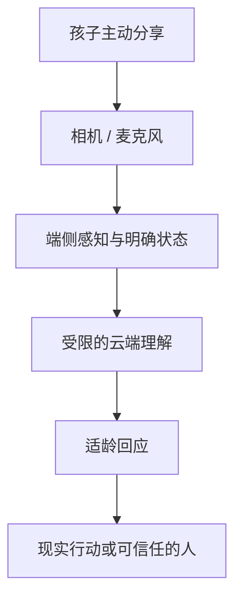

# CyberJOJO 2027

> 一个愿意听你说、陪你认识世界，也提醒你拥抱真实生活的 AI 成长伙伴。

[体验产品](https://cyberjojo.mikeywa.site/) · 项目介绍：`/intro` · 素材陈列馆：`/assets`

当前相机原型的代码名是 **JOCAM**。它不是一台用来“打卡荣誉”的相机，而是 CyberJOJO 2027 的第一块交互界面：孩子把摄像头对准此刻正在经历的生活，叫叫看见、倾听、回应，再把注意力温柔地还给真实世界。

## 先看见这个孩子

项目的视觉母题来自一个很简单的瞬间：在疲惫、孤独或不知如何开口时，一个带有未来感的 AI 形象俯身靠近，先向真实的人打招呼。

我们想保留的不是某部科幻作品的表面风格，而是其中“被看见”的情绪结构。App Icon 里的叫叫从数字世界探入现实，代表 AI 对人的关怀：它不抢走生活的主角位置，只在孩子需要时靠近一点。

## 我们在做什么

孩子可以把 CyberJOJO 当作一个持续但有边界的成长伙伴：向它分享今天看到的东西、问关于世界的问题、练习描述感受，也在一次次被认真回应后，逐渐形成表达欲、好奇心和健康的人格。

它最重要的目标不是延长使用时长，而是帮助孩子：

- 更愿意说出“我看见了什么、我在想什么、我现在是什么感受”；
- 把问题变成观察、实验、阅读、运动或与真人交流；
- 在重要成长阶段获得稳定但不过度占有的支持；
- 最终更有能力离开屏幕，进入真实世界。

## 为什么需要摄像头

语言模型只能听见一个问题，摄像头让 AI 与孩子拥有“共同注意”：它知道孩子指的是哪片叶子、哪道题、哪只刚刚飞走的鸟，也能让还不擅长组织语言的孩子从“你看这个”开始表达。

摄像头不是为了监控，更不等于默认持续上传。我们的原则是：

- **孩子主动发起**：明确的取景、快门或提问动作才触发理解；
- **最少必要采集**：能在端侧完成的感知尽量留在设备上，服务端只接收完成当前回应所需的信息；
- **状态始终可见**：摄像头、麦克风、上传与记忆状态不能藏在后台；
- **随时可以拒绝**：遮住镜头、退出对话、删除记录都应简单且不受惩罚。

## 为什么和豆包等通用 AI 不一样

差异不在于换一个角色皮肤，而在于产品契约不同。

| 维度 | 通用 AI 助手 | CyberJOJO 2027 |
| --- | --- | --- |
| 核心任务 | 回答问题、完成任务 | 陪孩子形成表达、探索和现实行动 |
| 交互起点 | 输入框里的指令 | 眼前正在发生的生活 |
| 回应方式 | 尽可能给出完整答案 | 适龄解释、追问、鼓励观察，并适时结束 |
| 成功指标 | 使用频率、完成率、时长 | 主动表达、现实行动、与真人分享、自然离开 |
| 关系边界 | 通用服务关系 | 不排他、不结盟、不替代家人老师和同伴 |
| 记忆原则 | 追求连续与个性化 | 可见、可删、可忘记，并由监护规则约束 |

## 如何避免沉迷与过度依赖

我们不把“永远在线”理解为“永远占用注意力”。一个合格的儿童 AI 伙伴，应当主动帮助孩子结束对话，而不是制造离不开它的关系。

- **不做情感绑架**：不说“只有我懂你”，不索要秘密，不因离开而失落或惩罚孩子；
- **把回应导向现实**：优先建议去摸一摸、画一画、问问家人、和同伴一起完成；
- **设置自然出口**：长对话会收束成一个线下小行动，完成后再回来分享，而非无限追问；
- **逐步退场**：孩子能力提升后，AI 从代答转向提示，从提示转向倾听；
- **高风险交还真人**：涉及伤害、欺凌、健康、家庭危机等情况时，鼓励并帮助联系可信任的成年人；
- **不用黏性做北极星**：不以 DAU、连续签到或使用时长衡量儿童陪伴的价值。

我们也承认：针对儿童的情感型 AI，目前在中国大陆及其他地区都面临快速变化的监管与伦理问题。这个项目不试图绕开这些限制，而是把原型当作一场公开探索——什么样的情感功能可以带来真实价值？哪些能力必须被禁止、降级或交还给人？如何让风险在产品结构上可控，而不只依赖一份免责声明？

## 当前原型

JOCAM 以“相机即陪伴界面”验证共同注意和具身表达，当前已包含：

- 前后摄像头、双镜头画中画、拍照与本地媒体库；
- 叫叫与绿豆 Rive 角色、手势和语音反馈；叫叫喂食时的眼神、头部和嘴部联动；
- OK、比心等端侧手势识别与人像/主体分割；
- 实时语音对话、场景理解、对话摘要与相机建议；
- 移动端手势、横竖屏适配、权限与异常状态处理；
- 原始音频、识别文字和图像不做服务端日志留存。

### 四个互动玩法

以下是当前代码中的首版范围。相机的「一起玩」入口包含喂食、找一找和介绍玩具；心情日记沿用日常对话与相册，不设独立入口。

| 玩法 | 当前流程 | 实现边界 |
| --- | --- | --- |
| 心情日记 | 从孩子自己的话整理事件、感受和想法，进入相册「当天小记」；可以展开、修改或选择「不记这件事」 | 感受可以留空，不从脸部表情猜测心理状态；只有聊天、没有照片的日期也可出现。记录保存在本机，删除会同步移出后续对话上下文 |
| 玩具朋友名片 | 定格玩具照片，尝试识别外观，再由孩子起名、纠正和补充介绍；预览确认后收藏到相册「朋友」 | 看不清时明确提示，可重新拍摄或由孩子介绍；同款玩具由孩子选择是否为已有朋友，不宣称自动身份识别。支持改名、替换封面、导出图片和删除 |
| 分你一口 | 镜头识别苹果、蛋糕或面条，出现对应 3D 食物；拖近叫叫嘴边张嘴，松手吃下并咀嚼，范围外松手返回 | 首版只适配叫叫和这三类食物；「自己选一个」是明确的手动备用道具。触屏拖动在本地执行，不上传拖拽轨迹，也不需要摄像头手指识别 |
| 叫叫找一找 | 根据当前画面出一个颜色或常见物品任务；把物品放入中心，或点选目标，稳住镜头后主动确认 | 服务端结合本轮目标与选中点验题；成功时高亮本次确认帧中的目标范围。当前是范围高亮，不是沿物体轮廓的精确分割 |

主动玩法期间暂停无关的自动场景点评。取消、切镜头或切换横竖屏会使旧请求失效，避免上一轮的识别结果突然触发新一轮反馈。低置信、限流和网络失败会保留可恢复的提示，不作为识别成功处理；真实场景下的识别精度仍需在目标设备上验证。

键盘也可操作：焦点移到食物后按回车或空格喂一口；找一找的选中圆圈可用方向键移动，回车回到中心。Escape 结束当前玩法并返回入口焦点。

叫叫的眼神与转头使用 Rive 原资源中的真实控制节点。张嘴采用原文件的一帧口型，咀嚼采用单独的下颌开合曲线；不会用循环播放说话动画冒充咀嚼。控制器已在本地浏览器中验证嘴部位置、方向变化、开合和退出复位，仍需随完整相机界面进行设备联调。

朋友名片的封面使用独立本地存储，不依赖普通作品库的最新 30 项保留规则。当前没有账号同步；清除浏览器站点数据会移除本机日记、作品和朋友收藏。

### 素材陈列馆与 3D 食物

本地启动后访问 `/assets`，可按类别浏览和搜索模型、Rive 角色、品牌图标、界面图标、图片、声音、字体及运行资源。页面提供原文件下载：3D 模型可旋转、缩放和复位；Rive 预览按需载入，动画选项直接读取原文件；音频可以试听。清单来自 `public/asset-catalog.json`，记录实际文件大小、校验和及模型面数。

喂食使用 `public/models/food/` 中的三个独立 GLB，包含真实几何和材质，使用 Three.js 渲染；不是将图片做成旋转效果。模型由项目脚本生成，不依赖远程贴图，模型授权见该目录的 `LICENSE.txt`。`src/assets-gallery/FoodModel.jsx` 同时供喂食和素材页复用，可见时加载，离开时释放图形资源。

```bash
# 修改模型生成逻辑后重建三个 GLB
node scripts/generate-food-models.mjs
# 添加、替换、删除素材后更新陈列馆清单
node scripts/generate-asset-manifest.mjs
```



## 仍需回答的问题

- 哪些情感表达是支持，哪些会构成操纵或依赖？
- 摄像头带来的理解增益，是否足以抵偿隐私与误识别风险？
- 儿童、监护人和 AI 之间，谁可以看见、修改或删除记忆？
- 如何验证孩子正在变得更敢表达、更愿意接触真实社会，而不是更擅长与 AI 相处？
- 如何针对不同年龄建立可审计、可降级、可退出的能力分层？

## 本地开发

需要 Node.js 20.19+ 或 22.12+，以当前 Vite 依赖要求为准。

```bash
npm install
npm run dev
```

浏览器访问 Vite 输出的本地地址。摄像头与麦克风在非 `localhost` 环境下需要 HTTPS。

## 更新日志与发布记录

封面右上角提供低调的「更新日志」「资源」入口。`/changelog/` 按北京时间每天合并变化，默认展示当天摘要，展开可查看主分支提交与真实发布时间。

`npm run history:generate` 根据当前 `HEAD` 的主线历史生成 `public/changelog.json`，开发启动和构建会自动执行；文件无需提交。每日中文摘要可在 `src/changelog/notes.json` 维护，未编写摘要的日期显示真实提交标题。Git 不保留准确推送时间，因此代码记录使用提交时间，不把它冒充上线时间。

发布前先提交并同步 `main`，再构建，确保日志包含本次代码。`deploy/install-static.sh` 用于前端发布，`deploy/install-cyberjojo.sh` 用于前后端一起发布；部署检查成功后，两者都通过 `deploy/record-release.py` 将实际 UTC 上线时间与构建 SHA 原子写入源站 `/var/www/jocam/release-history.json`。Nginx 提供同名只读 URL，页面按北京时间合并，多次发布在同一天内展开显示。旧发布记录缺少可信时间时不作推测。

部署时须复制完整 `deploy/` 工具目录（包括 `record-release.py` 和 seed）。只更新前端时，将构建压缩为 `/tmp/cyberjojo-static-$RELEASE_TAG.tgz`，在源站以 root 执行 `RELEASE_TAG=... bash deploy/install-static.sh`。原有语音服务保持运行。全量发布的后端包须包含完整 `deploy/` 目录。

资源页还提供果汁饮料和包装糖果两个日常食物模型，支持预览、旋转、缩放及 GLB 下载。

## 测试与构建

```bash
npm test
npm run build
```

Vite 构建产物输出到 `dist/`。可以用 `JOCAM_ASSET_BASE` 覆盖静态资源基地址。

## 语音与视觉服务

`server/` 是只运行在服务端的 Node.js 桥接，不会被 Vite 打包到浏览器。复制 `server/voice.env.example` 到服务器 `/etc/jocam/voice.env`，填入语音服务与火山方舟所需配置，并将环境文件权限设为 `0600`。

```bash
npm run voice-server
```

正式环境的服务配置由 `jocam-voice.service` 管理。`deploy/nginx-cyberjojo.conf` 将 `/api/voice`、`/api/vision`、`/api/gameplay`、`/api/conversation-summary` 与 `/api/health` 转发到 `127.0.0.1:8787`，并对静态资源、摄像头和麦克风权限设置响应头。`deploy/install-cyberjojo.sh` 支持前端与语音服务成套切换，并在检查失败时回退两个版本及 Nginx 配置。

服务端限制来源域名、单 IP 并发数和会话时长；图像理解另有限流，且不记录原始音频、识别文字或图像。

`/api/gameplay` 为食物识别、玩具观察、出题和验题提供独立的结构化接口，复用现有火山方舟视觉模型与服务端凭据。主动请求采用独立限流，不套用自动场景点评的 12 秒等待周期。请求图像为最长边 640 像素的 JPEG，前后端校验大小、用途、回合及画面标识；不新增原图的服务端持久化。

## 模型与角色资源

- 叫叫 Rive：SHA-256 `a4301637d7200e00f3f43b2d3145a75801891443d07d9fd2a24a6948cfe65287`
- 绿豆 Rive：SHA-256 `cb114cd3107aecf2cf9d5ee71d5f9a3f688dd2379c8ae6394862bac4b00de4fe`
- MediaPipe 手势模型：SHA-256 `97952348cf6a6a4915c2ea1496b4b37ebabc50cbbf80571435643c455f2b0482`
- MediaPipe DeepLab V3：SHA-256 `ff36e24d40547fe9e645e2f4e8745d1876d6e38b332d39a82f0bf0f5d1d561b3`

当前 `public/media/jiaojiao.riv` 来自[叫叫原文件页面 ZHc](https://rive.mikeywa.site/ZHc)，原文件名为 `ai叫叫学伴_源文件_叫叫_（黑）.riv`，大小 6,447,356 字节。该导出保留 47 条时间轴；闭嘴使用 `Talking_Normal` 的第 0 帧，缺少的期待、受惊、OK 动作分别使用好奇、惊讶、夸赞动作。相比旧版，随机表情种类减少，详见 `docs/rive-ZHc-validation-2026-09-11.md`。

当前 `public/media/lvdou.riv` 来自[绿豆原文件页面](https://rive.mikeywa.site/qdg)，原文件名为 `ai叫叫学伴_源文件_绿豆_3d（0908）.riv`，大小 1,632,399 字节。上面的校验和对应仓库中的这份文件；替换素材后应同步更新资源清单与校验信息。具体预览和资源维护方式见 `src/assets-gallery/README.md`。

## 项目状态

CyberJOJO 2027 目前是黑客松阶段原型。我们正在验证的，不只是“AI 能不能陪伴儿童”，而是更困难也更值得尽早回答的问题：**一个具备情感能力的 AI，怎样才能既真正关心人，又不让人失去独立成长的能力。**
